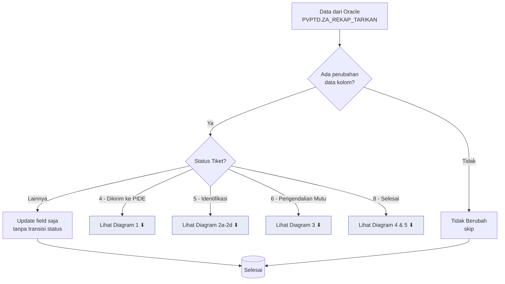
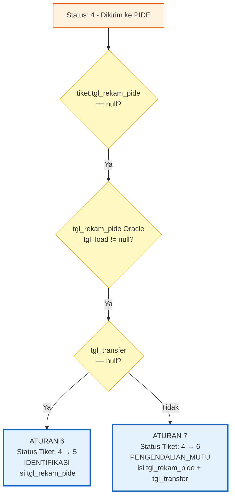
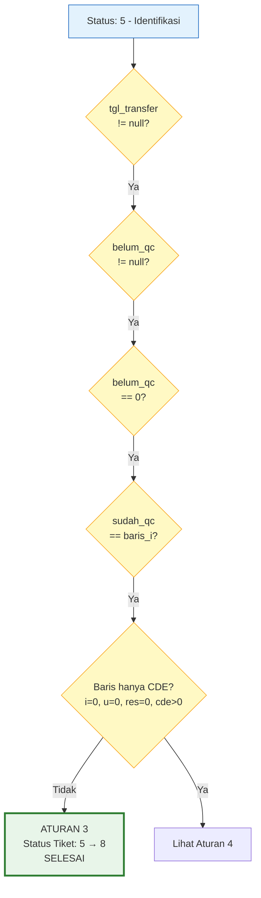
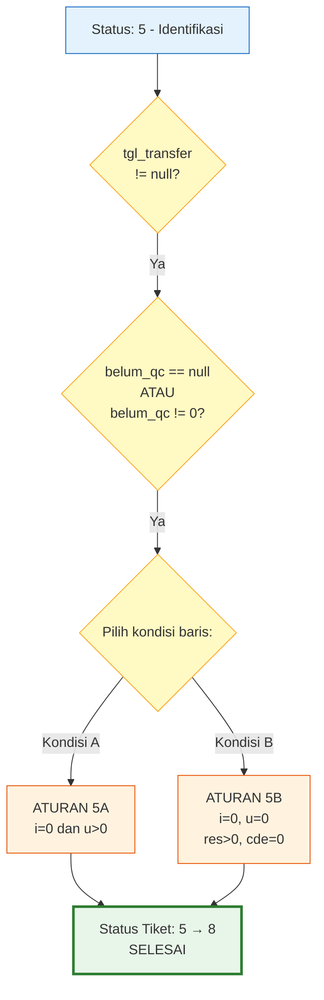
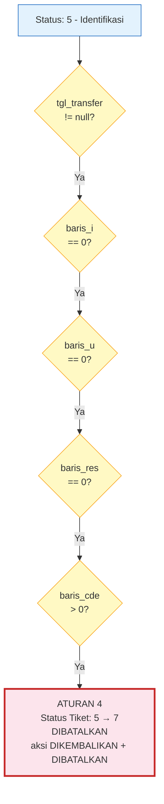
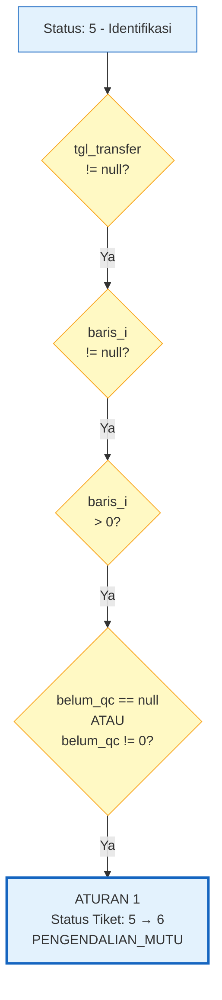
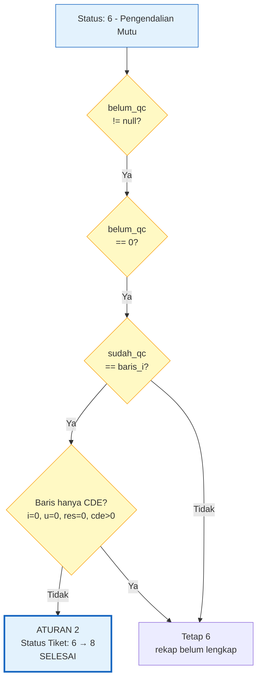
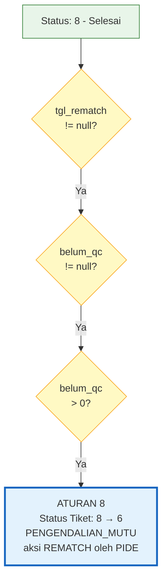
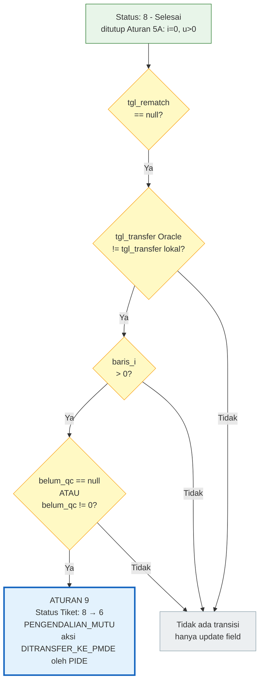

# Sinkronisasi Oracle — Aturan Transisi Status Tiket

**File**: `diamond_web/views/sync_tiket_update.py`
**Terakhir diperbarui**: 1 Oktober 2026

---

## Diagram Alur Logika



### Diagram 1 — Aturan 6 & 7: Dikirim ke PIDE (4) → Identifikasi (5) / Pengendalian Mutu (6)



### Diagram 2a — Aturan 3: Identifikasi (5) → Selesai (8) — QC Lengkap



### Diagram 2b — Aturan 5A / 5B: Identifikasi (5) → Selesai (8) — Berbasis Baris



### Diagram 2c — Aturan 4: Identifikasi (5) → Dibatalkan (7), dikembalikan PIDE



### Diagram 2d — Aturan 1: Identifikasi (5) → Pengendalian Mutu (6)



### Diagram 3: Keputusan di Status Pengendalian Mutu (6)



### Diagram 4 — Aturan 8: Selesai (8) → Pengendalian Mutu (6) — Rematch



### Diagram 5 — Aturan 9: Selesai (8) → Pengendalian Mutu (6) — Revisi Tarikan



> **Keterangan singkatan**: `i` = baris_i (Identifikasi), `u` = baris_u (Update), `res` = baris_res (Residual), `cde` = baris_cde (CDE)

---

## Daftar Isi

1. [Ikhtisar](#ikhtisar)
2. [Sumber Data (Query Oracle)](#sumber-data-query-oracle)
3. [Perilaku Umum](#perilaku-umum)
4. [Aturan Transisi Status](#aturan-transisi-status)
   - [Aturan 1: Identifikasi (5) → Pengendalian Mutu (6)](#aturan-1-identifikasi-5--pengendalian-mutu-6)
   - [Aturan 2: Pengendalian Mutu (6) → Selesai (8)](#aturan-2-pengendalian-mutu-6--selesai-8)
   - [Aturan 3: Identifikasi (5) → Selesai (8) — QC Lengkap](#aturan-3-identifikasi-5--selesai-8--qc-lengkap)
   - [Aturan 4: Identifikasi (5) → Dibatalkan (7), dikembalikan PIDE](#aturan-4-identifikasi-5--dibatalkan-7-dikembalikan-pide)
   - [Aturan 5: Identifikasi (5) → Selesai (8) — Berbasis Baris](#aturan-5-identifikasi-5--selesai-8--berbasis-baris)
   - [Aturan 6: Dikirim ke PIDE (4) → Identifikasi (5)](#aturan-6-dikirim-ke-pide-4--identifikasi-5)
   - [Aturan 7: Dikirim ke PIDE (4) → Pengendalian Mutu (6)](#aturan-7-dikirim-ke-pide-4--pengendalian-mutu-6)
   - [Aturan 8: Selesai (8) → Pengendalian Mutu (6) — Rematch](#aturan-8-selesai-8--pengendalian-mutu-6--rematch)
   - [Aturan 9: Selesai (8) → Pengendalian Mutu (6) — Revisi Tarikan](#aturan-9-selesai-8--pengendalian-mutu-6--revisi-tarikan)
5. [Diagram Alur Keputusan di Status 5](#diagram-alur-keputusan-di-status-5)
6. [Ringkasan Jejak Audit TiketAction](#ringkasan-jejak-audit-tiketaction)
7. [Penugasan Peran PIC](#penugasan-peran-pic)
8. [Pelacakan Progres & Kunci Cache](#pelacakan-progres--kunci-cache)
9. [Logging & CSV](#logging--csv)
10. [Penanganan Error](#penanganan-error)

---

## Ikhtisar

Modul `sync_tiket_update` menyinkronkan kolom QC dan transfer dari Oracle (`PVPTD.ZA_REKAP_TARIKAN`) ke record `Tiket` Django lokal. Modul ini melakukan **pembaruan tingkat field** pada tiket yang cocok dan menerapkan **transisi status otomatis** dengan jejak audit lengkap (`TiketAction`) dan notifikasi.

Titik masuk yang tersedia:
- **`_check_tiket_update_data()`** — Mode *dry-run*: menghitung apa yang akan berubah tanpa memodifikasi database.
- **`_update_tiket_data()`** — Mode sinkronisasi langsung: menerapkan semua pembaruan dan transisi.
- **Sinkronisasi satu tiket** (`SinkronisasiTiketView`, tombol **Sinkronisasi dari Oracle** di Detail Tiket, khusus Admin PMDE) — menjalankan aturan yang sama untuk satu tiket, dengan pratinjau sebelum disimpan.

Dua yang pertama dipanggil melalui tugas Celery (`check_tiket_update_data_task` / `sync_tiket_update_data_task`) dan dapat dihentikan di tengah eksekusi melalui sinyal berhenti berbasis *cache*.

Aturan per tiket berada di dua fungsi yang dipakai bersama oleh `_update_tiket_data()` dan sinkronisasi satu tiket, sehingga keduanya tidak mungkin berbeda:
- **`_plan_tiket_update(tiket, row)`** — membandingkan kolom dan mengevaluasi seluruh aturan transisi terhadap tiket *sebelum* diubah, tanpa menulis apa pun. Hasilnya (kolom yang berubah, transisi, aksi yang akan dicatat) juga menjadi isi pratinjau.
- **`_apply_tiket_update_plan(tiket, plan, pics, sync_id)`** — menulis rencana tsb: field & status tiket, `TiketAction`, notifikasi, dan CSV hasil.

Sinkronisasi satu tiket memakai query Oracle yang sama, disaring pada `no_tiket` tiket tsb (ditambah bentuk `E` 16 karakter untuk nomor `EI`, karena query mengubah bentuk itu menjadi `EI`). Saat disimpan, data Oracle diambil ulang dan rencananya dibandingkan dengan pratinjau melalui *fingerprint*; bila berbeda, tidak ada yang ditulis dan pratinjau terbaru ditampilkan. Hasilnya dicatat di CSV `tiket_update_result_{sync_id}.csv` seperti sinkronisasi massal.

> **Catatan**: `_check_tiket_update_data()` (dry-run massal) masih memiliki salinan kondisi aturannya sendiri. Perubahan aturan harus diterapkan di sana **dan** di `_plan_tiket_update()`.

---

## Sumber Data (Query Oracle)

Query Oracle `_TIKET_UPDATE_ORACLE_SQL` mengambil data agregat dari `PVPTD.ZA_REKAP_TARIKAN` yang dikelompokkan berdasarkan `no_tiket`.

### Kolom yang Diambil

| Kolom | Sumber | Deskripsi |
|-------|--------|-----------|
| `nomor_tiket` | `no_tiket` (dengan transformasi prefiks `EI`) | Identifikator tiket |
| `tgl_rekam_pide` | `MIN(tgl_load)` | Tanggal data mulai direkam PIDE |
| `baris_i` | `SUM(JML_LOG)` | Jumlah baris identifikasi |
| `baris_u` | `SUM(JML_LOG_U)` | Jumlah baris *update* |
| `baris_res` | `SUM(JML_RES)` | Jumlah baris residual |
| `baris_cde` | `SUM(JML_CDE)` | Jumlah baris CDE |
| `tgl_transfer` | `MIN(tgl_transfer)` | Tanggal transfer ke PMDE |
| `tgl_rematch` | `MAX(tgl_rematch)` | Tanggal *rematch* |
| `tgl_close_tiket` | `CASE WHEN belum_qc=0 THEN tgl_qc ELSE NULL END` | Tanggal penyelesaian QC |
| `sudah_qc` | `COALESCE(SUM(SUDAH_QC), 0)` | Baris yang sudah di-QC |
| `belum_qc` | `COALESCE(SUM(belum_qc), 0)` | Baris yang belum di-QC |
| `lolos_qc` | `COALESCE(SUM(lolos_qc), 0)` | Baris yang lolos QC |
| `tidak_lolos_qc` | `COALESCE(SUM(TIDAK_LOLOS_QC), 0)` | Baris yang tidak lolos QC |
| `qc_p` hingga `qc_d` | `COALESCE(SUM(QC_*), 0)` | Hitungan per kategori QC |

> **Catatan**: `belum_qc` dalam query menggunakan `COALESCE(..., 0)`, sehingga selalu mengembalikan angka (0 atau lebih). Namun, kode Python memeriksa `is not None` karena kursor Oracle mentah mengembalikan `None` untuk nilai NULL dalam beberapa kasus sebelum COALESCE diterapkan.

### Transformasi Nomor Tiket

Nomor tiket dengan panjang 16 yang diawali dengan 'E' akan diganti karakter keduanya: `E...` → `EI...` (contoh: `E123456789012345` → `EI123456789012345`).

---

## Perilaku Umum

### Pembaruan Field (Semua Tiket)

Sebelum logika transisi status, field berikut dibandingkan dan diperbarui jika berubah:

- `tgl_transfer`
- `tgl_rematch`
- `baris_i`, `baris_u`, `baris_res`, `baris_cde`
- `sudah_qc`, `belum_qc`, `lolos_qc`, `tidak_lolos_qc`
- `qc_p`, `qc_x`, `qc_w`, `qc_f`, `qc_a`, `qc_c`, `qc_n`
- `qc_y`, `qc_z`, `qc_u`, `qc_e`, `qc_v`, `qc_r`, `qc_d`

Suatu tiket dianggap "berubah" hanya jika setidaknya satu field berbeda **atau** ada transisi status yang berlaku. Jika tidak ada yang berubah, akan dicatat sebagai "Tidak Berubah" dan dilewati.

#### Tiket Dibatalkan (7): hasil tarikan tidak disalin

Tarikan tiket yang dibatalkan sudah tidak berlaku (PIDE menghapusnya dari Oracle), sehingga kolom hasil tarikannya dikosongkan dan **tidak pernah disalin kembali** (`KOLOM_TARIKAN_DIBATALKAN` di `diamond_web/utils/tiket_dibatalkan.py`):

- `baris_i`, `baris_u`, `baris_res`
- `sudah_qc`, `belum_qc`, `lolos_qc`, `tidak_lolos_qc`
- `qc_p` hingga `qc_d`

`baris_cde` **tetap** disalin dan tidak dikosongkan — itulah baris yang dikembalikan PIDE, dan kartu P3DE di Home (*Pengembalian Sebagian dari PIDE*, *Diklarifikasi*) membacanya pada tiket yang dibatalkan. `tgl_transfer` dan `tgl_rematch` juga tetap, karena mencatat apa yang terjadi di PIDE.

Kolom tsb dikosongkan di **semua** jalur pembatalan: Batalkan Tiket (P3DE), Kembalikan ke P3DE (PIDE), dan Aturan 4. Sinkronisasi massal hanya **tidak menyalin**; ia tidak mengosongkan sisa nilai yang sudah ada, karena hampir seluruh 9.722 tiket Dibatalkan hasil migrasi membawa nilai (umumnya 0) di kolom tsb. Sisa nilai pada tiket yang dibatalkan sebelum aturan ini ada dikosongkan per tiket lewat **Sinkronisasi dari Oracle** di Detail Tiket — juga ketika tiket tsb sudah tidak ada di rekap Oracle (`_plan_tanpa_rekap`).

### Tarikan Res/CDE Saja: Status Diubah Manual

Bila tarikan **hanya** berisi baris Res dan/atau CDE, yaitu `baris_i` dan `baris_u` bernilai 0 atau null serta `baris_res > 0` atau `baris_cde > 0` (`_status_manual()`), sinkronisasi **tidak mengubah status tiket menjadi Pengendalian Mutu, Selesai, maupun Dikembalikan/Dibatalkan**. Statusnya diubah manual oleh PIC. Sinkronisasi hanya memperbarui nilai kolom (termasuk `baris_i`, `baris_u`, `baris_res`, `baris_cde`) lewat pembaruan field umum.

Akibatnya:
- **Aturan 7** tidak membawa tiket ke Pengendalian Mutu. Tiket Dikirim ke PIDE yang datanya sudah direkam dan ditransfer di Oracle berhenti di **Identifikasi** lewat Aturan 6 (aksi Identifikasi, `tgl_rekam_pide` diisi), dan `tgl_transfer` tetap disalin.
- **Aturan 8** (*rematch*) tidak membuka kembali tiket Selesai ke Pengendalian Mutu.
- Aturan 1 dan 9 memang hanya berlaku bila `baris_i > 0`, jadi tidak pernah berlaku untuk komposisi ini.
- **Aturan 2, 3, dan 5B** tidak menutup tiket dengan komposisi ini.
- **Aturan 4** tidak pernah berlaku lagi, karena seluruh komposisinya (`i=0, u=0, res=0, cde>0`) termasuk kasus ini. Kodenya tetap ada, dan konstanta catatannya masih dipakai Koreksi Pembatalan untuk tiket yang dibatalkan sebelum perubahan ini.
- Aturan 5A (`i=0, u>0`) tetap berlaku karena ada baris U.

Bila tiket tertahan di Identifikasi (5) atau Pengendalian Mutu (6) dan tarikannya sudah ditransfer (`_status_tertahan()`), atau *rematch*-nya tidak diterapkan (Selesai), sinkronisasi:
- mencatat baris `Status Tetap (Res/CDE saja)` di CSV hasil (dry-run: di detail `Akan Diupdate`);
- mengirim notifikasi **Status Tiket Perlu Diubah Manual** ke PIC PIDE dan PMDE aktif, **sekali**: hanya pada eksekusi yang menyalin `tgl_transfer`, `tgl_rematch`, atau kolom baris baru ke tiket;
- di pratinjau Sinkronisasi dari Oracle, menampilkan kotak *Status diubah manual*.

### Notifikasi PIC PIDE dan PMDE

Setiap transisi status oleh sinkronisasi (Aturan 1–9, massal maupun satu tiket) mengirim notifikasi ke **semua PIC PIDE dan PMDE aktif** tiket tsb, masing-masing satu kali walaupun pengguna yang sama memegang kedua peran. Pesannya berisi tautan ke Detail Tiket, seperti notifikasi aksi manual (`NOTIFIKASI_TRANSISI`):

| Transisi | Judul |
|----------|-------|
| Aturan 6 (4 → 5) | Tiket Diidentifikasi |
| Aturan 1, 7 (→ 6) | Tiket ditransfer ke PMDE |
| Aturan 2, 3, 5 (→ 8) | Tiket Selesai |
| Aturan 4 (5 → 7) | Tiket Dikembalikan (P3DE tetap menerima notifikasinya sendiri) |
| Aturan 8 (8 → 6) | Tiket Di-rematch |
| Aturan 9 (8 → 6) | Tiket Ditransfer Ulang ke PMDE |

Tiket tanpa PIC PIDE/PMDE aktif tidak mengirim notifikasi ini.

> **Catatan**: `tgl_rekam_pide` **tidak** termasuk dalam pembaruan field umum. Field ini hanya ditulis oleh Aturan 6 & 7 (saat masih kosong di tiket lokal) dan dikosongkan oleh Aturan 4, sehingga tanggal yang diinput manual oleh PIDE tidak pernah ditimpa.

### Penanganan *Timestamp*

Semua nilai *datetime* dari Oracle diproses melalui `_make_aware_datetime()`:
- Jika `USE_TZ=True`: *datetime* naif dibuat sadar zona waktu.
- Jika `USE_TZ=False`: *datetime* sadar zona waktu dihapus informasi zona waktunya.

### Pemrosesan Batch

- **SQLite**: ukuran batch 50
- **PostgreSQL**: ukuran batch 500
- **Lainnya** (Oracle, MySQL): ukuran batch 250

### Pre-fetching PIC

Semua record `TiketPIC` aktif untuk tiket yang cocok di-*pre-fetch* dengan `select_related('id_user')` dan diatur ke dalam peta: `{tiket_id: {role: [pic, ...]}}`. Peta ini digunakan untuk menetapkan pengguna ke record `TiketAction`.

---

## Aturan Transisi Status

### Aturan 1: Identifikasi (5) → Pengendalian Mutu (6)

**Nama variabel**: `needs_pmde` / `needs_pmde_transition`

#### Kondisi (semua harus benar)

| Kondisi | Deskripsi |
|---------|-----------|
| `tiket.status_tiket == STATUS_IDENTIFIKASI` (5) | Status saat ini adalah Identifikasi |
| `tgl_transfer is not None` | Oracle memiliki tanggal transfer |
| `baris_i is not None and baris_i > 0` | Ada baris identifikasi |
| `belum_qc is None or belum_qc != 0` | QC belum selesai (eksklusif dari Aturan 3 & 5) |

#### Perubahan Status

`tiket.status_tiket = STATUS_PENGENDALIAN_MUTU` (6)

#### TiketAction yang Dibuat

| Field | Nilai |
|-------|-------|
| **Aksi** | `TiketActionType.DITRANSFER_KE_PMDE` |
| **Pengguna** | PIC **PIDE** aktif pertama untuk tiket ini |
| **Waktu** | `tgl_transfer or timezone.now()` |
| **Catatan** | `'Tiket ditransfer ke PMDE'` |

#### Fallback

Jika tidak ada PIC PIDE aktif yang ditemukan, status tetap diperbarui tetapi peringatan dicatat dan tidak ada `TiketAction` yang dibuat.

#### Pencatatan (CSV)

- **Kategori**: `'Status → Pengendalian Mutu'`
- **Detail**: `'Dari IDENTIFIKASI ke PENGENDALIAN_MUTU (I:{baris_i}, U:{baris_u}, Res:{baris_res}, CDE:{baris_cde})'`

---

### Aturan 2: Pengendalian Mutu (6) → Selesai (8)

**Nama variabel**: `needs_selesai` / `needs_selesai_transition`

#### Kondisi (semua harus benar)

| Kondisi | Deskripsi |
|---------|-----------|
| `tiket.status_tiket == STATUS_PENGENDALIAN_MUTU` (6) | Status saat ini adalah Pengendalian Mutu |
| `_qc_lengkap(...)` | QC selesai: `belum_qc == 0`, **`sudah_qc == baris_i`**, dan barisnya **bukan** `i=0, u=0, res=0, cde>0` |
| `not _status_manual(...)` | Tarikan bukan Res/CDE saja (lihat [Tarikan Res/CDE Saja](#tarikan-rescde-saja-status-diubah-manual)) |

> **Kenapa tidak cukup `belum_qc == 0`**: bila tabel rekap tarikan (`PVPTD.ZA_REKAP_TARIKAN`) baru terbentuk sebagian, baris I atau hitungan QC tiket bisa belum masuk, sehingga `belum_qc` terbaca 0 padahal QC belum selesai. Aturan 2 lalu menutup tiket yang masih punya baris untuk di-QC. Contohnya, tiket dengan I 609 dan U 1.112 ditutup pada 28/09/2026, padahal Belum QC-nya 609. Rekap yang lengkap selalu memenuhi `sudah_qc + belum_qc == baris_i`, karena hanya baris I yang di-QC. Di data lokal per 30/09/2026, seluruh 1.133 tiket yang pernah ditutup sinkronisasi memenuhinya. Rekap yang hanya berisi baris CDE tidak punya apa pun untuk di-QC, jadi juga tidak dianggap selesai (lihat Aturan 4). Tiket yang tertahan oleh syarat ini tetap di Pengendalian Mutu sampai rekapnya lengkap.

#### Perubahan Status

`tiket.status_tiket = STATUS_SELESAI` (8)

#### TiketAction yang Dibuat (2 aksi)

**Aksi 1: PENGENDALIAN_MUTU**
| Field | Nilai |
|-------|-------|
| **Pengguna** | PIC **PMDE** aktif pertama untuk tiket ini |
| **Waktu** | `tgl_close_tiket or timezone.now()` |
| **Catatan** | `'Tiket selesai pengendalian mutu'` |

**Aksi 2: SELESAI**
| Field | Nilai |
|-------|-------|
| **Pengguna** | PIC PMDE yang sama |
| **Waktu** | `tgl_close_tiket or timezone.now()` |
| **Catatan** | `'Tiket selesai diproses)'` |

#### Fallback

Jika tidak ada PIC PMDE aktif yang ditemukan, status tetap diperbarui tetapi peringatan dicatat dan tidak ada `TiketAction` yang dibuat.

---

### Aturan 3: Identifikasi (5) → Selesai (8) — QC Lengkap

**Nama variabel**: `needs_selesai_from_5` / `needs_selesai_from_5_transition`

#### Kondisi (semua harus benar)

| Kondisi | Deskripsi |
|---------|-----------|
| `tiket.status_tiket == STATUS_IDENTIFIKASI` (5) | Status saat ini adalah Identifikasi |
| `tgl_transfer is not None` | Oracle memiliki tanggal transfer |
| `_qc_lengkap(...)` | QC selesai seluruhnya: `belum_qc == 0` dan `sudah_qc == baris_i` (lihat Aturan 2), dan barisnya **bukan** `i=0, u=0, res=0, cde>0` — eksklusif dari Aturan 4 |
| `not _status_manual(...)` | Tarikan bukan Res/CDE saja |

Aturan ini menangani kasus di mana QC telah selesai di Oracle sebelum sinkronisasi berjalan — tiket dapat melewati status 6 dan langsung ke 8.

> **Kenapa tiket yang barisnya hanya CDE dikecualikan**: tiket seperti itu **selalu** punya `belum_qc == 0` karena tidak ada baris yang perlu di-QC, bukan karena QC-nya selesai. Sebelum pengecualian ini, Aturan 3 dan Aturan 4 menyala bersamaan pada tiket itu: jejaknya mendapat aksi Ditransfer ke PMDE, Pengendalian Mutu dan Selesai, lalu statusnya ditimpa Aturan 4 (contoh: `PV034050126071001`). Di data per 25/08/2026, ke-383 tiket yang barisnya hanya CDE punya `belum_qc = 0`, dan 369 di antaranya Dibatalkan.

#### Perubahan Status

`tiket.status_tiket = STATUS_SELESAI` (8)

#### TiketAction yang Dibuat (3 aksi)

**Aksi 1: DITRANSFER_KE_PMDE** (oleh PIDE)
| Field | Nilai |
|-------|-------|
| **Pengguna** | PIC **PIDE** aktif pertama untuk tiket ini |
| **Waktu** | `tgl_transfer or timezone.now()` |
| **Catatan** | `'Tiket ditransfer ke PMDE'` |

**Aksi 2: PENGENDALIAN_MUTU** (oleh PMDE)
| Field | Nilai |
|-------|-------|
| **Pengguna** | PIC **PMDE** aktif pertama untuk tiket ini |
| **Waktu** | `tgl_close_tiket or timezone.now()` |
| **Catatan** | `'Tiket selesai pengendalian mutu'` |

**Aksi 3: SELESAI** (oleh PMDE)
| Field | Nilai |
|-------|-------|
| **Pengguna** | PIC PMDE yang sama |
| **Waktu** | `tgl_close_tiket or timezone.now()` |
| **Catatan** | `'Tiket selesai diproses'` |

#### Fallback

Setiap peran diselesaikan secara **independen**:
- Tidak ada PIC PIDE → aksi `DITRANSFER_KE_PMDE` dilewati dengan peringatan.
- Tidak ada PIC PMDE → aksi `PENGENDALIAN_MUTU` dan `SELESAI` dilewati dengan peringatan.

---

### Aturan 4: Identifikasi (5) → Dibatalkan (7), dikembalikan PIDE

> **Tidak berlaku lagi sejak 1 Oktober 2026.** Komposisinya (`i=0, u=0, res=0, cde>0`) adalah tarikan Res/CDE saja, sehingga tiket tetap di Identifikasi dan PIDE mengembalikannya secara manual bila perlu (lihat [Tarikan Res/CDE Saja](#tarikan-rescde-saja-status-diubah-manual)). Uraian di bawah menjelaskan apa yang ditulis aturan ini pada tiket yang dibatalkannya sebelum tanggal itu, yang masih dikenali oleh Koreksi Pembatalan dan `fix_tiket_dikembalikan_sync`.

**Nama variabel**: `needs_dikembalikan` / `needs_dikembalikan_transition`

#### Kondisi (semua harus benar)

| Kondisi | Deskripsi |
|---------|-----------|
| `tiket.status_tiket == STATUS_IDENTIFIKASI` (5) | Status saat ini adalah Identifikasi |
| `tgl_transfer is not None` | Oracle memiliki tanggal transfer |
| `baris_i == 0` | Tidak ada baris identifikasi |
| `baris_u == 0` | Tidak ada baris *update* |
| `baris_res == 0` | Tidak ada baris residual |
| `baris_cde > 0` | Tetapi ada baris CDE (hanya entri revisi data) |

Aturan ini mendeteksi tiket yang hanya memiliki entri CDE (koreksi/revisi data) tanpa data identifikasi/*update*/residual yang sebenarnya. Ini diperlakukan sama dengan tombol **Dikembalikan** manual oleh PIDE: tiket dibatalkan.

Aturan ini tidak memeriksa `belum_qc` — tiket yang barisnya hanya CDE selalu `belum_qc == 0`. Aturan 3 yang mengalah (lihat di atas).

#### Perubahan Status

`tiket.status_tiket = STATUS_DIBATALKAN` (7) — sama dengan tombol Dikembalikan manual. Sebelumnya aturan ini menulis `STATUS_DIKEMBALIKAN` (3), status buntu yang tidak bisa dikirim lagi ke PIDE; lihat [Perbaikan Retroaktif](#perbaikan-retroaktif-aturan-4).

#### Pembaruan Field Tambahan

| Field | Nilai |
|-------|-------|
| `tgl_dikembalikan` | `tgl_transfer or timezone.now()`, digeser ke tepat setelah aksi terakhir tiket bila jatuh di hari yang sama (lihat catatan waktu di bawah) |
| `tgl_rekam_pide` | `None` (dihapus) |
| `baris_i`, `baris_u`, `baris_res`, `sudah_qc`, `belum_qc`, `lolos_qc`, `tidak_lolos_qc`, `qc_p`–`qc_d` | `None` — tidak disalin dari rekap; lihat [Tiket Dibatalkan](#tiket-dibatalkan-7-hasil-tarikan-tidak-disalin). `baris_cde` tetap disalin. |

#### TiketAction yang Dibuat (2 aksi)

**Aksi 1: DIKEMBALIKAN** (oleh PIDE)
| Field | Nilai |
|-------|-------|
| **Pengguna** | PIC **PIDE** aktif pertama untuk tiket ini |
| **Waktu** | sama dengan `tgl_dikembalikan` |
| **Catatan** | `'Tiket dikembalikan oleh PIDE (auto-sync)'` |

**Aksi 2: DIBATALKAN** (diatribusikan ke P3DE)
| Field | Nilai |
|-------|-------|
| **Pengguna** | PIC **P3DE** aktif pertama untuk tiket ini |
| **Waktu** | sama dengan `tgl_dikembalikan` |
| **Catatan** | `'Tiket dibatalkan (dikembalikan oleh PIDE: auto-sync)'` |

> **Catatan waktu**: `tgl_transfer` dari Oracle hanya berisi tanggal (jam 00:00). Pada hari yang sama PIDE merekam data, aksi pengembalian bisa tampil **sebelum** aksi Identifikasi yang sebenarnya mendahuluinya (contoh: `PV034050126071001` — Identifikasi 14/09 16:42, pengembalian 14/09 00:00). Waktu aksi pengembalian dan `tgl_dikembalikan` karena itu digeser dengan `lift_time_above()` ke 1 menit setelah aksi terakhir tiket, **hanya bila di hari yang sama**; tanggalnya tidak berubah. Aksi Identifikasi dan `tgl_transfer` tetap disimpan — keduanya mencatat yang memang terjadi di PIDE, sama seperti tiket yang dikembalikan manual.

#### Notifikasi

Dikirim ke **semua PIC P3DE aktif** untuk tiket ini:
- **Judul**: `'Tiket Dikembalikan'`
- **Pesan**: `'Tiket {nomor_tiket} telah dikembalikan oleh PIDE (auto-sync)'`

#### Fallback

Setiap peran diselesaikan secara **independen**:
- Tidak ada PIC PIDE → aksi `DIKEMBALIKAN` dilewati dengan peringatan.
- Tidak ada PIC P3DE → aksi `DIBATALKAN` dilewati dengan peringatan.
- Tidak ada PIC P3DE → tidak ada notifikasi yang dikirim.

#### Perbaikan Retroaktif (Aturan 4)

Perintah `fix_tiket_dikembalikan_sync` memperbaiki tiket yang terlanjur diproses aturan lama:

```bash
python manage.py fix_tiket_dikembalikan_sync --dry-run     # lihat dulu
python manage.py fix_tiket_dikembalikan_sync               # terapkan
python manage.py fix_tiket_dikembalikan_sync --tiket PV034050126071001
```

- **Status**: setiap tiket berstatus Dikembalikan (3) → Dibatalkan (7). Hanya sinkronisasi yang pernah menulis status 3; tiket berstatus 3 tanpa aksi *auto-sync* di jejaknya tetap diubah, tetapi ditandai di laporan untuk diperiksa manual.
- **Jejak aksi**: aksi yang ditulis Aturan 3 pada eksekusi yang sama dihapus — yaitu aksi yang berada tepat di bawah pasangan DIKEMBALIKAN/DIBATALKAN *auto-sync* terakhir (urutan id), dengan catatan persis milik Aturan 3, dalam salah satu dari tiga bentuk yang bisa ditinggalkannya: `SELESAI + PENGENDALIAN_MUTU + DITRANSFER_KE_PMDE`, hanya pasangan PMDE, atau hanya `DITRANSFER_KE_PMDE` (tergantung PIC yang aktif). Aksi transfer dan pengendalian mutu juga harus ber-*timestamp* sama dengan aksi *auto-sync* (keduanya `tgl_transfer`). Putaran asli sebelumnya tidak tersentuh.
- **Waktu pengembalian**: pasangan DIKEMBALIKAN/DIBATALKAN *auto-sync* (dan `tgl_dikembalikan` bila sama) digeser ke 1 menit setelah aksi sebelumnya di hari yang sama, sama seperti yang kini dilakukan sinkronisasi.
- Aksi **DIKEMBALIKAN** dan **DIBATALKAN** tetap disimpan, begitu pula aksi **Identifikasi** dan `tgl_transfer`.
- **Idempoten**: eksekusi kedua tidak menemukan status 3, aksi Aturan 3, maupun pasangan yang perlu digeser.

#### Koreksi Pembatalan dan Koreksi Penutupan (Sinkronisasi satu tiket)

Bila tabel rekap tarikan di Oracle baru terbentuk sebagian, tarikan terbaca hanya berisi baris CDE (baris I, U, dan Res masih 0) sehingga Aturan 4 membatalkan tiket. Setelah rekap lengkap, tiket seharusnya berlanjut dari Identifikasi, tetapi tidak ada aturan yang keluar dari status Dibatalkan (7).

Hal yang sama bisa menutup tiket: `belum_qc` terbaca 0, sehingga Aturan 2 (atau Aturan 3/5 dari Identifikasi) mengubahnya menjadi Selesai padahal masih ada baris yang belum di-QC. Syarat `_qc_lengkap` kini mencegah Aturan 2 dan 3 melakukannya, tetapi tiket yang sudah terlanjur ditutup tetap tertahan: Aturan 8 hanya berlaku bila ada rematch, dan Aturan 9 hanya bila tanggal transfernya berubah.

Tombol **Sinkronisasi dari Oracle** di Detail Tiket (tidak di sinkronisasi massal) mengoreksi keduanya lebih dulu (`_plan_koreksi`, dipanggil lewat `_plan_tiket_update(tiket, row, koreksi=True)`). Yang dilihat hanya aksi alur kerja tiket (Direkam s.d. Rematch). Ubah isian, perubahan PIC, dan sejenisnya yang dicatat setelahnya tidak menghalangi koreksi.

**Koreksi Pembatalan**, bila **semua** benar:

| Kondisi | Keterangan |
|---------|------------|
| `tiket.status_tiket == 7` | Tiket Dibatalkan |
| Aksi alur kerja terakhir tiket (urutan id) adalah aksi *auto-sync* Aturan 4 | `DIKEMBALIKAN` "Tiket dikembalikan oleh PIDE (auto-sync)" dan/atau `DIBATALKAN` "Tiket dibatalkan (dikembalikan oleh PIDE: auto-sync)". Pembatalan manual, atau langkah alur kerja lain yang dicatat setelahnya, tidak dikoreksi |
| Oracle `baris_i`, `baris_u`, atau `baris_res` > 0 | Rekap kini tidak lagi hanya berisi baris CDE |

Koreksinya:
- **Menghapus** aksi DIKEMBALIKAN/DIBATALKAN *auto-sync* tsb.
- Mengembalikan field yang diubah Aturan 4: status → Identifikasi (5); `tgl_rekam_pide` → `tgl_load` dari Oracle, atau *timestamp* aksi Identifikasi terakhir bila Oracle kosong; `tgl_dikembalikan` → *timestamp* aksi Dikembalikan sebelumnya, atau kosong bila tidak ada.
- Aturan 1–9 lalu dievaluasi terhadap tiket **setelah koreksi**, sehingga tiket berlanjut seperti bila tidak pernah dibatalkan. Misalnya, bila ada baris I yang belum di-QC, Aturan 1 membawa tiket ke Pengendalian Mutu (6) dengan aksi Ditransfer ke PMDE. Bila QC sudah lengkap, Aturan 3 membawanya ke Selesai (8).
- Mengirim notifikasi **Pembatalan Tiket Dikoreksi** ke PIC P3DE aktif, yang sebelumnya menerima notifikasi *Tiket Dikembalikan*.
- Mencatat baris `Koreksi Pembatalan` di CSV hasil.

**Koreksi Penutupan**, bila **semua** benar:

| Kondisi | Keterangan |
|---------|------------|
| `tiket.status_tiket == 8` | Tiket Selesai |
| Oracle `belum_qc > 0` | Masih ada baris yang belum di-QC |
| Oracle `tgl_rematch` kosong | Bila ada rematch, Aturan 8 yang membuka tiket |
| Oracle `tgl_transfer` == `tiket.tgl_transfer` | Tarikan yang sama dengan yang ditutup. Tarikan baru (revisi) ditangani Aturan 9 |
| Aksi alur kerja terakhir tiket adalah aksi penutupan sinkronisasi | `PENGENDALIAN_MUTU` "Tiket selesai pengendalian mutu", lalu `SELESAI` "Tiket selesai diproses)" (Aturan 2) atau "Tiket selesai diproses" (Aturan 3/5). Tiket data migrasi ("… (data migrasi, tanggal perkiraan)") atau yang ditutup tanpa PIC PMDE aktif (tanpa aksi) tidak dikoreksi |

> Tanda kurung penutup pada catatan SELESAI Aturan 2 adalah salah ketik lama. Tanda itu **sengaja dipertahankan**, karena itulah yang membedakan penutupan Aturan 2 dari Aturan 3/5 di jejak yang sudah tertulis.

Koreksinya:
- Aturan 2: **menghapus** aksi Pengendalian Mutu dan Selesai tsb, lalu status → Pengendalian Mutu (6). Aksi Ditransfer ke PMDE sebelumnya (dari Aturan 1) tetap.
- Aturan 3/5: **menghapus** aksi Pengendalian Mutu dan Selesai, serta aksi Ditransfer ke PMDE yang ditulis pada eksekusi yang sama (*timestamp*-nya sama dengan aksi Pengendalian Mutu), lalu status → Identifikasi (5). Aturan 1 kemudian membawanya ke Pengendalian Mutu dengan aksi Ditransfer ke PMDE yang baru.
- Aturan lalu dievaluasi terhadap tiket setelah koreksi. Karena `belum_qc > 0`, tiket tidak ditutup lagi.
- Mencatat baris `Koreksi Penutupan` di CSV hasil. Koreksi itu sendiri tidak mengirim notifikasi; transisi yang menyusul (mis. Aturan 1) mengirim notifikasinya ke PIC PIDE dan PMDE seperti biasa.

Pratinjau menampilkan langkah koreksi (mis. Dibatalkan → Identifikasi, atau Selesai → Pengendalian Mutu), aksi yang akan dihapus, lalu transisi aturan yang menyusul. Koreksi ikut masuk ke *fingerprint*.

---

### Aturan 5: Identifikasi (5) → Selesai (8) — Berbasis Baris

**Nama variabel**: `needs_selesai_from_5_baris` / `needs_selesai_from_5_baris_transition`

#### Kondisi (semua harus benar)

| Kondisi | Deskripsi |
|---------|-----------|
| `tiket.status_tiket == STATUS_IDENTIFIKASI` (5) | Status saat ini adalah Identifikasi |
| `tgl_transfer is not None` | Oracle memiliki tanggal transfer |
| `belum_qc is None or belum_qc != 0` | QC belum selesai (eksklusif dari Aturan 3) |
| **Kondisi A** ATAU **Kondisi B** (lihat di bawah) | Pola baris cocok |

**Kondisi A** (*update* murni — tanpa identifikasi, hanya *update*):
| Field | Nilai |
|-------|-------|
| `baris_i == 0` | Tidak ada baris identifikasi |
| `baris_u > 0` | Tetapi ada baris *update* |

**Kondisi B** (hanya residual — tanpa i/u, tanpa cde) — **tidak berlaku lagi sejak 1 Oktober 2026**: tarikan Res saja, jadi statusnya diubah manual (lihat [Tarikan Res/CDE Saja](#tarikan-rescde-saja-status-diubah-manual)):
| Field | Nilai |
|-------|-------|
| `baris_i == 0` | Tidak ada baris identifikasi |
| `baris_u == 0` | Tidak ada baris *update* |
| `baris_res > 0` | Tetapi ada baris residual |
| `baris_cde == 0` | Tidak ada baris CDE |

Aturan ini menangani kasus tepi di mana data telah ditransfer tetapi komposisinya tidak memerlukan alur kerja PMDE penuh — baik hanya ada *update* (tanpa identifikasi) atau hanya entri residual (tanpa koreksi CDE).

#### Perubahan Status

`tiket.status_tiket = STATUS_SELESAI` (8)

#### TiketAction yang Dibuat (3 aksi)

Identik dengan Aturan 3 — **peran PIC sama, waktu sama, catatan sama**.

| Aksi | Peran PIC | Waktu | Catatan |
|------|-----------|-------|---------|
| `DITRANSFER_KE_PMDE` | PIDE | `tgl_transfer` | `'Tiket ditransfer ke PMDE'` |
| `PENGENDALIAN_MUTU` | PMDE | `tgl_close_tiket` | `'Tiket selesai pengendalian mutu'` |
| `SELESAI` | PMDE | `tgl_close_tiket` | `'Tiket selesai diproses'` |

#### Fallback

Sama seperti Aturan 3 — setiap peran diselesaikan secara independen.

---

### Aturan 6: Dikirim ke PIDE (4) → Identifikasi (5)

**Nama variabel**: `needs_identifikasi` / `needs_identifikasi_transition`

Aturan ini mem-*backfill* tiket yang datanya sudah direkam PIDE di Oracle (`tgl_load` terisi) tetapi belum pernah ditandai identifikasi di DIAMOND.

#### Kondisi (semua harus benar)

| Kondisi | Deskripsi |
|---------|-----------|
| `tiket.status_tiket == STATUS_DIKIRIM_KE_PIDE` (4) | Status saat ini adalah Dikirim ke PIDE |
| `tiket.tgl_rekam_pide is None` | Belum ada tanggal rekam PIDE di tiket lokal |
| `tgl_rekam_pide is not None` | Oracle memiliki `tgl_load` |
| `tgl_transfer is None` **atau** `_status_manual(...)` | Belum ditransfer ke PMDE, atau tarikannya Res/CDE saja (Aturan 7 tidak berlaku) |

#### Perubahan Status & Field

| Field | Nilai |
|-------|-------|
| `status_tiket` | `STATUS_IDENTIFIKASI` (5) |
| `tgl_rekam_pide` | `tgl_rekam_pide` dari Oracle (`MIN(tgl_load)`) |

#### TiketAction yang Dibuat

| Field | Nilai |
|-------|-------|
| **Aksi** | `TiketActionType.IDENTIFIKASI` |
| **Pengguna** | PIC **PIDE** aktif pertama untuk tiket ini |
| **Waktu** | `tgl_rekam_pide or timezone.now()` |
| **Catatan** | `'Mulai proses identifikasi'` |

#### Fallback

Jika tidak ada PIC PIDE aktif, status dan `tgl_rekam_pide` tetap diperbarui tetapi peringatan dicatat dan tidak ada `TiketAction` yang dibuat.

Jika `tgl_load` di Oracle NULL, **tidak ada transisi** — tiket tetap di status 4 (hanya field lain yang diperbarui).

#### Pencatatan (CSV)

- **Kategori**: `'Status → Identifikasi'`
- **Detail**: `'Dari DIKIRIM_KE_PIDE ke IDENTIFIKASI (Tgl Rekam PIDE:{tgl_rekam_pide})'`

---

### Aturan 7: Dikirim ke PIDE (4) → Pengendalian Mutu (6)

**Nama variabel**: `needs_pmde_from_4` / `needs_pmde_from_4_transition`

Sama seperti Aturan 6, tetapi Oracle sudah mencatat transfer ke PMDE — tiket melompati status 5 dan langsung ke 6 dengan kedua jejak audit dibuat.

#### Kondisi (semua harus benar)

| Kondisi | Deskripsi |
|---------|-----------|
| `tiket.status_tiket == STATUS_DIKIRIM_KE_PIDE` (4) | Status saat ini adalah Dikirim ke PIDE |
| `tiket.tgl_rekam_pide is None` | Belum ada tanggal rekam PIDE di tiket lokal |
| `tgl_rekam_pide is not None` | Oracle memiliki `tgl_load` |
| `tgl_transfer is not None` | Oracle memiliki tanggal transfer |
| `not _status_manual(...)` | Tarikan bukan Res/CDE saja. Bila Res/CDE saja, Aturan 6 yang berlaku: tiket berhenti di Identifikasi (lihat [Tarikan Res/CDE Saja](#tarikan-rescde-saja-status-diubah-manual)) |

#### Perubahan Status & Field

| Field | Nilai |
|-------|-------|
| `status_tiket` | `STATUS_PENGENDALIAN_MUTU` (6) |
| `tgl_rekam_pide` | `tgl_rekam_pide` dari Oracle (`MIN(tgl_load)`) |
| `tgl_transfer` | `tgl_transfer` dari Oracle (`MIN(tgl_transfer)`) |

#### TiketAction yang Dibuat (2 aksi)

| Aksi | Peran PIC | Waktu | Catatan |
|------|-----------|-------|---------|
| `IDENTIFIKASI` | PIDE | `tgl_rekam_pide` | `'Mulai proses identifikasi'` |
| `DITRANSFER_KE_PMDE` | PIDE | `tgl_transfer` | `'Tiket ditransfer ke PMDE'` |

#### Fallback

Jika tidak ada PIC PIDE aktif, status dan field tetap diperbarui tetapi peringatan dicatat dan **kedua** aksi dilewati.

Jika `tgl_load` di Oracle NULL, **tidak ada transisi** — tiket tetap di status 4.

#### Pencatatan (CSV)

- **Kategori**: `'Status → Pengendalian Mutu'`
- **Detail**: `'Dari DIKIRIM_KE_PIDE ke PENGENDALIAN_MUTU (Tgl Rekam PIDE:{tgl_rekam_pide}, Tgl Transfer:{tgl_transfer})'`

> **Catatan**: Transisi lanjutan (misalnya 6 → 8 saat `belum_qc == 0`) **tidak** dievaluasi pada eksekusi yang sama, karena semua kondisi transisi dihitung dari status tiket **sebelum** perubahan. Tiket akan berpindah lebih lanjut pada sinkronisasi berikutnya.

---

### Aturan 8: Selesai (8) → Pengendalian Mutu (6) — Rematch

**Nama variabel**: `needs_rematch` / `needs_rematch_transition`

*Rematch* di Oracle mencocokkan ulang data tarikan sehingga baris QC baru muncul pada tiket yang sudah ditutup. Aturan ini membuka kembali tiket tersebut agar PMDE dapat menyelesaikan QC sisanya.

#### Kondisi (semua harus benar)

| Kondisi | Deskripsi |
|---------|-----------|
| `tiket.status_tiket == STATUS_SELESAI` (8) | Status saat ini adalah Selesai |
| `tgl_rematch is not None` | Oracle memiliki tanggal *rematch* (`MAX(tgl_rematch)`) |
| `belum_qc is not None and belum_qc > 0` | Masih ada baris yang belum di-QC |
| `not _status_manual(...)` | Tarikan bukan Res/CDE saja; bila Res/CDE saja, tiket tetap Selesai dan PIC menerima notifikasi status manual |

#### Perubahan Status

`tiket.status_tiket = STATUS_PENGENDALIAN_MUTU` (6)

Tidak ada field tanggal lain yang ditulis oleh aturan ini. `tgl_rematch` sendiri tetap diperbarui melalui pembaruan field umum.

#### TiketAction yang Dibuat

| Field | Nilai |
|-------|-------|
| **Aksi** | `TiketActionType.REMATCH` (11) |
| **Pengguna** | PIC **PIDE** aktif pertama untuk tiket ini |
| **Waktu** | `tgl_rematch or timezone.now()` |
| **Catatan** | `'Tiket di-rematch oleh PIDE (auto-sync)'` |

#### Fallback

Jika tidak ada PIC PIDE aktif, status tetap diperbarui tetapi peringatan dicatat dan tidak ada `TiketAction` yang dibuat.

#### Pencatatan (CSV)

- **Kategori**: `'Status → Pengendalian Mutu (rematch)'`
- **Detail**: `'Dari SELESAI ke PENGENDALIAN_MUTU (Tgl Rematch:{tgl_rematch}, Belum QC:{belum_qc})'`

#### Penghitung

Transisi ini dihitung terpisah dari transisi PMDE lain: `status_to_rematch` (sinkronisasi) dan `would_rematch` (*dry-run*), bukan `status_to_pmde` / `would_pmde`.

> **Catatan**: Setelah dibuka kembali, tiket mengikuti Aturan 2 pada sinkronisasi berikutnya — begitu `belum_qc == 0` lagi, tiket kembali ke status 8 dengan aksi `PENGENDALIAN_MUTU` + `SELESAI` yang baru.

---

### Aturan 9: Selesai (8) → Pengendalian Mutu (6) — Revisi Tarikan

**Nama variabel**: `needs_transfer_ulang` / `needs_transfer_ulang_transition`

Tiket bisa ditutup langsung dari Identifikasi oleh **Aturan 5A** ketika tarikan pertama hanya berisi baris *update* (`i=0, u>0`) — tanpa pernah melewati PMDE. Beberapa hari kemudian PIC PIDE dapat **merevisi tarikan itu**: transfer ulang dengan `tgl_transfer` baru, dan kali ini `baris_i` ikut terisi. Komposisi barisnya sekarang persis kondisi Aturan 1 — tetapi statusnya sudah terlanjur `Selesai`, sehingga tidak ada aturan yang mengevaluasinya kembali.

Aturan 9 menutup celah itu: **komposisi baris yang sama harus mendarat di status yang sama**, baik datang dari status 5 maupun dari status 8.

#### Kondisi (semua harus benar)

| Kondisi | Deskripsi |
|---------|-----------|
| `tiket.status_tiket == STATUS_SELESAI` (8) | Status saat ini adalah Selesai |
| `tgl_rematch is None` | Bukan *rematch* — eksklusif dari Aturan 8 |
| `tgl_transfer is not None` | Oracle memiliki tanggal transfer |
| `tgl_transfer != tiket.tgl_transfer` | Tanggal transfer **berubah** pada sinkronisasi ini |
| `baris_i is not None and baris_i > 0` | Revisi membawa baris identifikasi |
| `belum_qc is None or belum_qc != 0` | QC belum selesai |

Tiga syarat terakhir **identik dengan Aturan 1**; dua syarat pertama yang membedakan titik berangkatnya.

> **Kenapa `baris_i > 0` wajib**: kalau revisi tetap menghasilkan `i=0, u>0`, itu komposisi yang justru **ditutup** Aturan 5A — membuka kembali tiket untuk komposisi tersebut akan melawan aturan yang menutupnya, dan tiket terjebak di PMDE selamanya karena tidak ada baris identifikasi yang bisa di-QC.

> **Kenapa perubahan `tgl_transfer` wajib**: tanpa syarat ini aturan berlaku ke setiap tiket Selesai yang `belum_qc`-nya belum nol — saat aturan ini ditulis ada **3.421** tiket seperti itu, dan semuanya akan dibuka kembali sekaligus pada sinkronisasi pertama. Syarat ini membatasi aturan pada tiket yang benar-benar baru direvisi PIDE. Nilai lama dibaca ke `prev_tgl_transfer` **sebelum** blok pembaruan field menimpanya.

#### Perubahan Status

`tiket.status_tiket = STATUS_PENGENDALIAN_MUTU` (6)

Tidak ada field tanggal lain yang ditulis oleh aturan ini. `tgl_transfer` dan kolom baris tetap diperbarui melalui pembaruan field umum.

#### TiketAction yang Dibuat

| Field | Nilai |
|-------|-------|
| **Aksi** | `TiketActionType.DITRANSFER_KE_PMDE` (9) |
| **Pengguna** | PIC **PIDE** aktif pertama untuk tiket ini |
| **Waktu** | `tgl_transfer or timezone.now()` — tanggal transfer **yang baru** |
| **Catatan** | `'Tiket ditransfer ulang ke PMDE — revisi tarikan oleh PIDE (I:{baris_i}, U:{baris_u})'` |

Aksi `DITRANSFER_KE_PMDE` / `PENGENDALIAN_MUTU` / `SELESAI` dari putaran tarikan sebelumnya **tidak dihapus atau diubah** — riwayat putaran lama tetap utuh dan aksi baru ditambahkan di atasnya, ditandai tanggal transfer yang berbeda.

#### Fallback

Jika tidak ada PIC PIDE aktif, status tetap diperbarui tetapi peringatan dicatat dan tidak ada `TiketAction` yang dibuat.

#### Pencatatan (CSV)

- **Kategori**: `'Status → Pengendalian Mutu (transfer ulang)'`
- **Detail**: `'Dari SELESAI ke PENGENDALIAN_MUTU (Tgl Transfer:{lama} → {baru}, I:{baris_i}, U:{baris_u}, Belum QC:{belum_qc})'`

#### Penghitung

`status_to_transfer_ulang` (sinkronisasi) dan `would_transfer_ulang` (*dry-run*) — terpisah dari `status_to_pmde` dan `status_to_rematch`.

> **Catatan**: Sama seperti Aturan 8, setelah dibuka kembali tiket mengikuti Aturan 2 pada sinkronisasi berikutnya — begitu `belum_qc == 0`, tiket kembali ke status 8 dengan aksi `PENGENDALIAN_MUTU` + `SELESAI` yang baru.

#### Perbaikan Retroaktif

Aturan 9 hanya bisa menyala pada sinkronisasi yang **pertama kali** melihat tanggal transfer baru, karena ia membandingkan `tgl_transfer` Oracle dengan yang sudah tersimpan di tiket. Tiket yang direvisi **sebelum** aturan ini ada karena itu tertahan permanen: sinkronisasi sudah terlanjur menyalin `tgl_transfer` (dan kolom baris) yang baru ke record lokal, sehingga setiap sinkronisasi berikutnya tidak melihat perubahan apa pun dan tiket tetap berstatus Selesai.

Perintah `fix_tiket_transfer_ulang` menerapkan apa yang seharusnya dilakukan Aturan 9 pada tiket-tiket itu.

```bash
python manage.py fix_tiket_transfer_ulang --dry-run     # lihat dulu
python manage.py fix_tiket_transfer_ulang               # terapkan
python manage.py fix_tiket_transfer_ulang --tiket PD411040126050601
```

**Kriteria deteksi** — komposisinya harus benar semua:

| Kondisi | Deskripsi |
|---------|-----------|
| `status_tiket == 8` dan `tgl_rematch is None` | Selesai, bukan *rematch* |
| `tgl_transfer is not None` | Punya tanggal transfer |
| `baris_i > 0` dan `belum_qc != 0` | Komposisi Aturan 1 — datanya bilang tiket ini seharusnya di pengendalian mutu |

…**dan salah satu** dari dua sidik jari jejak audit:

| Sidik jari | Deskripsi |
|-----------|-----------|
| **A** — tidak ada aksi `DITRANSFER_KE_PMDE` ber-*timestamp* sama dengan `tgl_transfer` tiket | Jejak tidak pernah mencatat transfer pada tanggal yang kini diklaim tiket |
| **B** — `tgl_transfer` lebih baru dari aksi `SELESAI` terakhir tiket | Transfer yang terjadi *sesudah* penutupan — mustahil pada tiket yang sehat |

Sidik jari **B** ada karena A saja berlubang: kalau `backfill_old_db_tiket_actions` dijalankan **setelah** PIDE merevisi tanggal transfer, ia menulis aksi transfer tepat di `tgl_transfer` yang sudah direvisi, sehingga jejaknya tampak utuh padahal tiketnya masih salah tertutup. `PD508040123120801` persis begitu — ditutup 24/07, tetapi ditransfer 28/07. B menangkapnya lewat kronologi.

Tidak satu pun sidik jari menyala pada tiket migrasi yang sehat: aksi transfernya duduk tepat di `tgl_transfer` (gagal A) dan penutupannya menyusul transfer, bukan mendahului (gagal B). Diverifikasi terhadap 3.392 tiket migrasi yang lolos filter komposisi: nol kecocokan untuk keduanya.

**Idempoten** lewat perubahan statusnya sendiri — perbaikan memindahkan tiket dari status 8, jadi eksekusi kedua tidak bisa melihatnya lagi.

Aksi `DITRANSFER_KE_PMDE` **tidak dibuat** bila jejaknya sudah punya satu di tanggal itu (kasus sidik jari B), supaya tidak menduplikasi.

**Tindakan per tiket**: `status_tiket` 8 → 6, dan satu `TiketAction` `DITRANSFER_KE_PMDE` oleh PIC PIDE aktif, ber-*timestamp* `tgl_transfer` yang berlaku sekarang. Aksi lama **tidak pernah dihapus atau diubah tanggalnya** — putaran yang sudah ditutup memang benar-benar terjadi atas data saat itu, revisinya ditambahkan di atasnya.


---

## Diagram Alur Keputusan di Status 5

Karena beberapa aturan menargetkan status 5, berikut adalah urutan prioritasnya (semua blok `if` independen, tetapi kondisinya saling eksklusif — Aturan 3 secara eksplisit mengecualikan komposisi Aturan 4):

```
                     ┌──────────────────────────────────┐
                     │  Status Tiket = 5 (Identifikasi) │
                     │  tgl_transfer tidak null         │
                     └────────────────┬─────────────────┘
                                      │
                    ┌─────────────────┴──────────────────┐
                    │                                    │
          baris hanya CDE                         selain itu
      (i=0, u=0, res=0, cde>0)                           │
                    │                    ┌───────────────┴───────────────┐
                    ▼                    │                               │
           ┌──────────────────┐    belum_qc == 0            belum_qc != 0 (atau null)
           │   ATURAN 4       │          │                               │
           │   5 → 7          │          ▼                    i=0,u>0 ATAU        i>0
           │   (Dibatalkan)   │ ┌──────────────────┐        i=0,u=0,res>0,cde=0     │
           └──────────────────┘ │   ATURAN 3       │                 │              ▼
                                │   5 → 8 (QC)     │                 ▼      ┌──────────────┐
                                └──────────────────┘      ┌──────────────────┐ │  ATURAN 1  │
                                                          │   ATURAN 5       │ │  5 → 6     │
                                                          │   5 → 8 (baris)  │ └──────────────┘
                                                          └──────────────────┘
```

| Prioritas | Kondisi | Aturan | Hasil |
|-----------|---------|--------|-------|
| 1 | `i` dan `u` 0/null, `res>0` atau `cde>0` | — (status manual) | Tetap 5, hanya kolom diperbarui; notifikasi ke PIDE & PMDE |
| 2 | `belum_qc == 0` | **Aturan 3** | 5 → 8 (QC lengkap) |
| 3 | `i==0, u>0` | **Aturan 5A** | 5 → 8 (berbasis baris) |
| 4 | `i>0` | **Aturan 1** | 5 → 6 (PMDE) |
| — | Tidak ada yang cocok | — | Tidak ada transisi |

> Diagram di atas menggambarkan aturan sebelum 1 Oktober 2026. Cabang Aturan 4 dan Aturan 5B kini masuk ke prioritas 1 (status manual).

---

## Ringkasan Jejak Audit TiketAction

### Semua Aksi yang Dibuat oleh Sinkronisasi

| Aturan | Tipe Aksi | Peran Pengguna | Sumber Waktu |
|--------|-----------|----------------|--------------|
| 1 (5→6) | `DITRANSFER_KE_PMDE` | PIDE | `tgl_transfer` |
| 2 (6→8) | `PENGENDALIAN_MUTU` | PMDE | `tgl_close_tiket` |
| 2 (6→8) | `SELESAI` | PMDE | `tgl_close_tiket` |
| 3 (5→8 QC) | `DITRANSFER_KE_PMDE` | PIDE | `tgl_transfer` |
| 3 (5→8 QC) | `PENGENDALIAN_MUTU` | PMDE | `tgl_close_tiket` |
| 3 (5→8 QC) | `SELESAI` | PMDE | `tgl_close_tiket` |
| 4 (5→7) | `DIKEMBALIKAN` | PIDE | `tgl_transfer` |
| 4 (5→7) | `DIBATALKAN` | P3DE | `tgl_transfer` |
| 5 (5→8 baris) | `DITRANSFER_KE_PMDE` | PIDE | `tgl_transfer` |
| 5 (5→8 baris) | `PENGENDALIAN_MUTU` | PMDE | `tgl_close_tiket` |
| 5 (5→8 baris) | `SELESAI` | PMDE | `tgl_close_tiket` |
| 6 (4→5) | `IDENTIFIKASI` | PIDE | `tgl_rekam_pide` |
| 7 (4→6) | `IDENTIFIKASI` | PIDE | `tgl_rekam_pide` |
| 7 (4→6) | `DITRANSFER_KE_PMDE` | PIDE | `tgl_transfer` |
| 8 (8→6) | `REMATCH` | PIDE | `tgl_rematch` |
| 9 (8→6) | `DITRANSFER_KE_PMDE` | PIDE | `tgl_transfer` (yang baru) |

---

## Penugasan Peran PIC

| Peran | Digunakan di | Tujuan |
|-------|-------------|--------|
| **PIDE** | Aturan 1, 3, 4, 5, 6, 7, 8, 9 | Membuat aksi `IDENTIFIKASI`, `DITRANSFER_KE_PMDE`, `DIKEMBALIKAN`, atau `REMATCH` |
| **PMDE** | Aturan 2, 3, 5 | Membuat aksi `PENGENDALIAN_MUTU` dan `SELESAI` |
| **P3DE** | Aturan 4 | Membuat aksi `DIBATALKAN` dan menerima notifikasi |

PIC diambil sebagai record `TiketPIC` dengan `active=True` untuk setiap tiket. Hanya PIC aktif **pertama** per peran yang digunakan untuk pembuatan `TiketAction`. Notifikasi transisi dan status manual dikirim ke **semua** PIC PIDE dan PMDE aktif (lihat [Notifikasi PIC PIDE dan PMDE](#notifikasi-pic-pide-dan-pmde)).

---

## Pelacakan Progres & Kunci Cache

### Mode Check (*Dry-Run*)

| Pola Kunci Cache | Tujuan |
|------------------|--------|
| `check_tiket_update_progress_{check_id}` | Penghitung progres saat ini |
| `check_tiket_update_done_{check_id}` | Boolean — operasi selesai |
| `check_tiket_update_in_progress_{check_id}` | Boolean — operasi berjalan |
| `check_tiket_update_result_{check_id}` | Dict hasil akhir |
| `check_tiket_update_error_{check_id}` | Pesan error jika gagal |
| `check_tiket_update_celery_task_id_{check_id}` | ID tugas Celery untuk pencabutan |
| `check_tiket_update_stop_requested_{check_id}` | Sinyal berhenti |

### Mode Sinkronisasi (Langsung)

| Pola Kunci Cache | Tujuan |
|------------------|--------|
| `tiket_update_progress_{sync_id}` | Penghitung progres saat ini |
| `tiket_update_done_{sync_id}` | Boolean — operasi selesai |
| `tiket_update_in_progress_{sync_id}` | Boolean — operasi berjalan |
| `tiket_update_result_{sync_id}` | Dict hasil akhir |
| `tiket_update_error_{sync_id}` | Pesan error jika gagal |
| `tiket_update_celery_task_id_{sync_id}` | ID tugas Celery untuk pencabutan |
| `tiket_update_stop_{sync_id}` | Sinyal berhenti |

### Struktur Data Progres

**Mode check** kunci progres:
```json
{
  "current": 0, "total": 0, "percentage": 0,
  "would_update": 0, "would_identifikasi": 0, "would_pmde": 0,
  "would_selesai": 0, "would_dikembalikan": 0, "would_rematch": 0,
  "would_transfer_ulang": 0,
  "would_unchanged": 0, "not_found": 0, "errors": 0
}
```

**Mode sinkronisasi** kunci progres:
```json
{
  "current": 0, "total": 0, "percentage": 0,
  "updated_rows": 0, "status_to_identifikasi": 0, "status_to_pmde": 0,
  "status_to_selesai": 0, "status_to_dikembalikan": 0, "status_to_rematch": 0,
  "status_to_transfer_ulang": 0,
  "not_found": 0, "unchanged": 0, "errors": 0
}
```

---

## Logging & CSV

Semua log CSV disimpan di direktori `sync_logs/` di root proyek.

### CSV Baris Gagal

**File**: `tiket_update_failed_rows_{sync_id}.csv`

| Kolom | Deskripsi |
|-------|-----------|
| `Timestamp` | Kapan error terjadi |
| `Row Number` | Indeks baris di hasil Oracle |
| `Nomor Tiket` | Identifikator tiket |
| `Error Reason` | Pesan error (dipotong hingga 200 karakter) |

### CSV Hasil

**File**: `tiket_update_result_{operation_id}.csv`

| Kolom | Deskripsi |
|-------|-----------|
| `Timestamp` | Kapan baris dicatat |
| `Nomor Tiket` | Identifikator tiket |
| `Kategori` | Salah satu dari: `Baris Diupdate`, `Belum Disinkronisasi`, `Status → Identifikasi`, `Status → Pengendalian Mutu`, `Status → Pengendalian Mutu (rematch)`, `Status → Pengendalian Mutu (transfer ulang)`, `Status → Selesai`, `Status → Dikembalikan`, `Status Tetap (Res/CDE saja)`, `Tidak Berubah`, `Error` |
| `Detail` | Konteks tambahan |

Setiap tiket dapat muncul **beberapa kali** jika termasuk dalam beberapa kategori (misalnya, "Baris Diupdate" + "Status → Pengendalian Mutu").

### Endpoint Unduhan

| Endpoint | Deskripsi |
|----------|-----------|
| `sync_tiket_update_download_errors` | Unduh `tiket_update_failed_rows_{sync_id}.csv` |
| `sync_tiket_update_download_result` | Unduh `tiket_update_result_{operation_id}.csv` |

---

## Penanganan Error

- Kesalahan pemrosesan baris individual ditangkap per baris — satu tiket yang gagal tidak memblokir seluruh sinkronisasi.
- Baris yang gagal dicatat ke CSV "baris gagal" dan dihitung dalam `errors`.
- Sinyal berhenti diperiksa setelah setiap baris — jika `stop_checker()` mengembalikan `True`, pemrosesan berhenti segera.
- Blok try/ecxcept terluar menangkap error fatal (misalnya, kegagalan koneksi Oracle, pengecualian tak terduga) dan mengembalikan hasil yang dinolkan dengan pesan error.
