# Model ER Diagram

```mermaid
erDiagram
    KategoriILAP {
        int id PK
        string id_kategori UK
        string nama_kategori UK
    }

    KategoriWilayah {
        int id PK
        string deskripsi UK
    }

    Kanwil {
        int id PK
        string kode_kanwil UK
        string nama_kanwil UK
    }

    KPP {
        int id PK
        string kode_kpp UK
        string nama_kpp UK
        int id_kanwil FK
    }

    ILAP {
        int id PK
        string id_ilap
        int id_kategori FK
        string nama_ilap
        int id_kategori_wilayah FK
        int id_kpp FK
        string alamat_ilap
        string kota_ilap
        string namapic_ilap
        string telp_kantor
        string fax_ilap
        string email_picilap
        string tujuan_surat
        string tembusan
        date create_date
        string create_by
        string jabatan_picilap
        string telp_pic
        date update_date
        string update_by
    }

    JenisTabel {
        int id PK
        string deskripsi UK
    }

    StatusData {
        int id PK
        string deskripsi UK
    }

    StatusPenelitian {
        int id PK
        string deskripsi UK
    }

    BentukData {
        int id PK
        string deskripsi UK
    }

    CaraPenyampaian {
        int id PK
        string deskripsi UK
    }

    MediaBackup {
        int id PK
        string deskripsi UK
    }

    DasarHukum {
        int id PK
        string kategori
        string deskripsi UK
        date start_date
        date end_date
    }

    PeriodePengiriman {
        int id PK
        string periode_penyampaian UK
        string periode_penerimaan
    }

    JenisDataILAP {
        int id PK
        int id_ilap FK
        string id_jenis_data
        string id_sub_jenis_data
        string nama_jenis_data
        string nama_sub_jenis_data
        string nama_tabel_I
        string nama_tabel_U
        int id_jenis_tabel FK
        int id_status_data FK
    }

    KlasifikasiJenisData {
        int id PK
        int id_sub_jenis_data FK
        int id_klasifikasi_tabel FK
    }

    PeriodeJenisData {
        int id PK
        int id_sub_jenis_data_ilap FK
        int id_periode_pengiriman FK
        date start_date
        date end_date
        int akhir_penyampaian
    }

    JenisPrioritasData {
        int id PK
        date start_date
        date end_date
        int id_sub_jenis_data_ilap FK
        string no_nd
        string tahun
    }

    DurasiJatuhTempo {
        int id PK
        int id_sub_jenis_data FK
        int seksi FK
        int durasi
        date start_date
        date end_date
    }

    User {
        int id PK
        string username UK
    }

    Group {
        int id PK
        string name UK
    }

    PIC {
        int id PK
        string tipe
        int id_sub_jenis_data_ilap FK
        int id_user FK
        date start_date
        date end_date
    }

    Notification {
        int id PK
        int recipient FK
        string title
        text message
        bool is_read
        datetime created_at
    }

    Tiket {
        int id PK
        string nomor_tiket UK
        bool old_db
        int status_tiket
        int id_periode_data FK
        int id_jenis_prioritas_data FK
        int periode
        int tahun
        int penyampaian
        string nomor_surat_pengantar
        datetime tanggal_surat_pengantar
        string nama_pengirim
        int id_bentuk_data FK
        int id_cara_penyampaian FK
        bool status_ketersediaan_data
        string alasan_ketidaktersediaan
        int baris_diterima
        int satuan_data
        datetime tgl_terima_vertikal
        datetime tgl_terima_dip
        bool backup
        bool tanda_terima
        int id_status_penelitian FK
        datetime tgl_teliti
        int baris_lengkap
        int baris_tidak_lengkap
        datetime tgl_nadine
        string nomor_nd_nadine
        datetime tgl_kirim_pide
        datetime tgl_dibatalkan
        datetime tgl_dikembalikan
        datetime tgl_rekam_pide
        int id_durasi_jatuh_tempo_pide FK
        int baris_i
        int baris_u
        int baris_res
        int baris_cde
        datetime tgl_transfer
        datetime tgl_rematch
        int id_durasi_jatuh_tempo_pmde FK
        int sudah_qc
        int belum_qc
        int lolos_qc
        int tidak_lolos_qc
        int qc_p
        int qc_x
        int qc_w
        int qc_f
        int qc_a
        int qc_c
        int qc_n
        int qc_y
        int qc_z
        int qc_u
        int qc_e
        int qc_v
        int qc_r
        int qc_d
    }

    TiketAction {
        int id PK
        int id_tiket FK
        int id_user FK
        datetime timestamp
        int action
        string catatan
    }

    TiketPIC {
        int id PK
        int id_tiket FK
        int id_user FK
        datetime timestamp
        int role
        bool active
    }

    TandaTerimaData {
        int id PK
        int nomor_tanda_terima
        int tahun_terima
        datetime tanggal_tanda_terima
        int id_ilap FK
        int id_perekam FK
        bool active
    }

    DetilTandaTerima {
        int id PK
        int id_tanda_terima FK
        int id_tiket FK
    }

    BackupData {
        int id PK
        int id_tiket FK
        string lokasi_backup
        string nama_file
        int id_media_backup FK
        int id_user FK
    }

    KirimPideTemp {
        int id PK
        int id_temp
        int id_tiket FK
        int id_user FK
    }

    DocxTemplate {
        int id PK
        string nama_template
        text deskripsi
        string jenis_dokumen
        string file_template
        bool active
        datetime created_at
        datetime updated_at
    }

    Kanwil ||--o{ KPP : has
    KategoriILAP ||--o{ ILAP : has
    KategoriWilayah ||--o{ ILAP : has
    KPP ||--o{ ILAP : has
    ILAP ||--o{ JenisDataILAP : has
    JenisTabel ||--o{ JenisDataILAP : classified_as
    StatusData ||--o{ JenisDataILAP : has_status
    JenisDataILAP ||--o{ KlasifikasiJenisData : classified_by
    DasarHukum ||--o{ KlasifikasiJenisData : used_in
    JenisDataILAP ||--o{ PeriodeJenisData : has_periods
    PeriodePengiriman ||--o{ PeriodeJenisData : defines
    JenisDataILAP ||--o{ JenisPrioritasData : has_priorities
    JenisDataILAP ||--o{ DurasiJatuhTempo : has_durations
    Group ||--o{ DurasiJatuhTempo : assigned_to_seksi
    JenisDataILAP ||--o{ PIC : has_pics
    User ||--o{ PIC : is_pic
    User ||--o{ Notification : receives
    PeriodeJenisData ||--o{ Tiket : references
    JenisPrioritasData ||--o{ Tiket : priority
    BentukData ||--o{ Tiket : data_format
    CaraPenyampaian ||--o{ Tiket : delivery_method
    StatusPenelitian ||--o{ Tiket : research_status
    DurasiJatuhTempo ||--o{ Tiket : pide_due_date
    DurasiJatuhTempo ||--o{ Tiket : pmde_due_date
    Tiket ||--o{ TiketAction : has_actions
    User ||--o{ TiketAction : performed_by
    Tiket ||--o{ TiketPIC : has_pics
    User ||--o{ TiketPIC : assigned_as_pic
    ILAP ||--o{ TandaTerimaData : receives
    User ||--o{ TandaTerimaData : recorded_by
    TandaTerimaData ||--o{ DetilTandaTerima : contains
    Tiket ||--o{ DetilTandaTerima : included_in
    Tiket ||--o{ BackupData : has_backups
    MediaBackup ||--o{ BackupData : stored_on
    User ||--o{ BackupData : backed_up_by
    Tiket ||--o{ KirimPideTemp : has_pide_temp
    User ||--o{ KirimPideTemp : created_by
```

## Legend

| Symbol | Meaning |
|--------|---------|
| `||--o{` | One-to-Many |
| `||--||` | One-to-One |
| `UK` | Unique Key |
| `PK` | Primary Key |
| `nullable` | Field can be NULL |

## Model Groups

### Master / Reference Data (extends `AuditTrailModel`)
KategoriILAP, KategoriWilayah, Kanwil, KPP, JenisTabel, StatusData, StatusPenelitian, BentukData, CaraPenyampaian, MediaBackup, DasarHukum, PeriodePengiriman

### ILAP & Data Classification
- **ILAP** — Main entity representing an ILAP institution
- **JenisDataILAP** — Types of data associated with each ILAP
- **KlasifikasiJenisData** — Many-to-many link between JenisDataILAP and DasarHukum
- **PeriodeJenisData** — Submission periods for each data type
- **JenisPrioritasData** — Priority designations for data types

### People & Roles
- **PIC** — Person In Charge (P3DE/PIDE/PMDE) assigned to data types
- **TiketPIC** — PIC assignments per ticket

### Tiket (Ticket/Case) System
- **Tiket** — Core ticket tracking data submissions
- **TiketAction** — Action log for tickets
- **DurasiJatuhTempo** — Due date durations per seksi (Group)

### Receipt & Backup
- **TandaTerimaData** — Receipt of data from ILAP
- **DetilTandaTerima** — Line items linking receipts to tickets
- **BackupData** — Backup records per ticket
- **KirimPideTemp** — Temporary PIDE submission records

### Supporting
- **Notification** — User notifications
- **DocxTemplate** — Document templates for report generation
