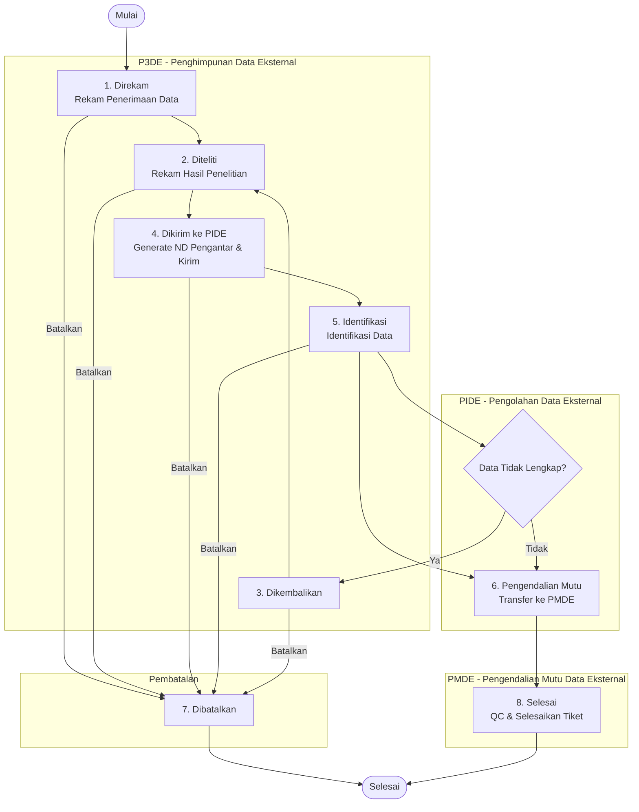

# Diagram Alur Status Tiket

Dokumen ini menjelaskan alur (*workflow*) status tiket pada sistem DIAMOND menggunakan diagram **Mermaid.js**.

---

## Status Tiket

| Kode | Label              | Penanggung Jawab | Deskripsi                                  |
|------|--------------------|------------------|--------------------------------------------|
| 1    | **Direkam**        | P3DE             | Tiket baru direkam oleh PIC P3DE           |
| 2    | **Diteliti**       | P3DE             | Hasil penelitian telah direkam oleh P3DE   |
| 3    | **Dikembalikan**   | PIDE             | Tiket dikembalikan PIDE ke P3DE            |
| 4    | **Dikirim ke PIDE**| P3DE             | Tiket dikirim dari P3DE ke PIDE            |
| 5    | **Identifikasi**   | PIDE             | PIDE sedang melakukan identifikasi data    |
| 6    | **Pengendalian Mutu** | PMDE          | PMDE sedang melakukan quality control      |
| 7    | **Dibatalkan**     | P3DE / PIDE      | Tiket dibatalkan/dikembalikan              |
| 8    | **Selesai**        | PMDE             | Tiket selesai diproses                     |

---

## Diagram Alur (Flowchart)



---

## Penjelasan Alur

### 1. P3DE: Rekam Penerimaan Data
**Status: Direkam (1)**

PIC P3DE memulai workflow dengan merekam data penerimaan melalui menu **Rekam Penerimaan Data** (`/tiket/rekam/`). Pada tahap ini, tiket dibuat dengan data-data seperti:
- Nomor tiket (otomatis)
- Periode data
- ILAP & Jenis Data
- Bentuk data dan cara penyampaian
- Tanggal terima
- Jumlah baris diterima

### 2. P3DE: Rekam Hasil Penelitian
**Status: Diteliti (2)**

Setelah tiket direkam, PIC P3DE melakukan penelitian awal dan merekam hasilnya melalui menu **Rekam Hasil Penelitian** (modal di halaman detail tiket). Data yang direkam:
- Status penelitian
- Tanggal teliti
- Baris lengkap / tidak lengkap

### 3. P3DE: Kirim Tiket ke PIDE
**Status: Dikirim ke PIDE (4)**

PIC P3DE mengirim tiket yang sudah diteliti ke PIDE melalui menu **Kirim Tiket ke PIDE** (`/tiket/kirim-tiket/`). Proses ini:
- Menampilkan daftar tiket dengan status **Diteliti (2)** atau **Dikembalikan (3)**
- Membuat dokumen **ND Pengantar PIDE** (format DOCX)
- Mengubah status tiket menjadi **Dikirim ke PIDE (4)**

### 4. PIDE: Identifikasi Data
**Status: Identifikasi (5)**

Setelah menerima tiket dari P3DE, PIC PIDE melakukan identifikasi data melalui menu **Identifikasi** (`/tiket/identifikasi/<pk>/update/`). Kegiatan ini mencakup:
- Identifikasi baris data (baris I, U, Res, CDE)
- Analisis awal data

### 5. Opsi: Dikembalikan ke P3DE
**Status: Dikembalikan (3) → Dibatalkan (7)**

Apabila data tidak lengkap atau bermasalah, PIC PIDE dapat mengembalikan tiket ke P3DE melalui menu **Dikembalikan** (modal di halaman detail tiket). Sistem akan:
- Mengubah status tiket menjadi **Dibatalkan (7)**
- Mencatat alasan pengembalian
- Mengirim notifikasi ke PIC P3DE terkait

PIC P3DE kemudian dapat memproses ulang tiket tersebut melalui **Kirim Tiket ke PIDE** yang akan menampilkan tiket dengan status tersebut.

### 6. PIDE: Transfer ke PMDE
**Status: Pengendalian Mutu (6)**

Setelah identifikasi selesai, PIC PIDE mentransfer tiket ke PMDE melalui menu **Transfer ke PMDE** (modal di halaman detail tiket). Data yang dicatat:
- Jumlah baris I (Identifikasi)
- Jumlah baris U (Update)
- Jumlah baris Res (Residual)
- Jumlah baris CDE

### 7. PMDE: Quality Control
**Status: Pengendalian Mutu (6)**

PIC PMDE melakukan quality control melalui menu **Quality Control** (`/quality-control/`). Tahapan QC meliputi:
- Pengecekan kualitas data
- Klasifikasi QC (P, X, W, F, A, C, N, Y, Z, U, E, V, R, D)
- Pencatatan jumlah baris sudah QC, lolos QC, dan tidak lolos QC

### 8. PMDE: Selesaikan Tiket
**Status: Selesai (8)**

Setelah QC selesai, PIC PMDE menyelesaikan tiket melalui menu **Selesaikan Tiket** (modal di halaman detail tiket). Ini adalah tahap akhir dari workflow.

### Pembatalan Sewaktu-waktu

PIC P3DE dapat membatalkan tiket **kapan saja** sebelum tiket dikirim ke PIDE melalui menu **Batalkan Tiket** (modal di halaman detail tiket). Tiket yang dibatalkan akan berstatus **Dibatalkan (7)**.

---

## Ringkasan Alur Normal

```
Direkam (1) → Diteliti (2) → Dikirim ke PIDE (4) → Identifikasi (5) → Pengendalian Mutu (6) → Selesai (8)
```

## Alur Alternatif

```
Direkam (1) → Diteliti (2) → Dikirim ke PIDE (4) → Identifikasi (5) 
                                                      ↓ (tidak lengkap)
                                                 Dikembalikan/Dibatalkan (7) → (kembali ke P3DE)
```

```
Setiap tahap → Dibatalkan (7) [Pembatalan oleh P3DE]
```
